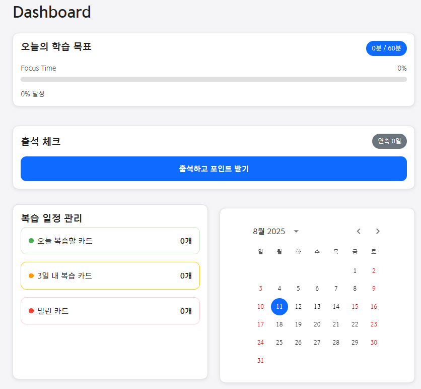

# Pomkist: AI 기반 통합 학습 및 복습 플랫폼

## 소개

Pomkist는 **AI 기술과 포모도로 학습법**을 결합하여, 학습의 흐름을 끊지 않고 메모 작성부터 노트 정리, 복습 문제 생성, 플래시카드 등록까지 한 번에 해결하는 **통합 학습 플랫폼**입니다.  
학습자가 본질적인 학습에 집중할 수 있도록, 반복적이고 번거로운 복습 준비 과정을 자동화합니다.

## 기술 스택

| 구분         | 기술/툴                                                        |
| ------------ | -------------------------------------------------------------- |
| Front-end    | Vite, React 18, TypeScript, Redux-Toolkit, React Router, MUI   |
| Back-end     | Java 17, Spring Boot 3.4.6, Spring Security, JPA, MariaDB 11.4.5, Redis 7.2 |
| AI           | Gemini, OpenAI 외부 AI API 활용                                |
| Infra        | AWS (EC2, ELB, RDS, ElastiCache, S3, CloudFront), Firebase SDK, GitHub Actions, AWS CodeDeploy |
| 기타         | PWA, Lighthouse CI, Axe-core(접근성/성능 자동화), Figma, Notion, Jira, Discord |

## 목차
1. [개요](#개요)
2. [주요 기능](#주요-기능)
3. [주요 서비스 화면](#주요-서비스-화면)
4. [기술 스택](#기술-스택)
5. [시스템 아키텍처](#시스템-아키텍처)
6. [협업 및 개발](#협업-및-개발)
7. [핵심 가치](#핵심-가치)
8. [팀원 소개](#팀원-소개)
9. [배포](#배포)

## 개요
### 프로젝트 기간   
*2025.05.26 ~ 2024.07.11*

## 주요 기능

- **포모도로 기반 메모 작성**
  - 집중 타이머와 노트 연동, 세션별 목표와 아이디어 자연스러운 기록
  - 최소한의 UI/UX로 방해 요소 최소화

- **AI 노트 자동 정리**
  - 메모 내용을 AI가 자동 분석·요약하여 구조화된 학습 자료 생성
  - 별도의 정리 시간 없이 논리적이고 간결한 노트 획득

- **AI 복습 문제 생성**
  - 문맥을 이해하는 AI가 맞춤형 복습 문제 자동 출제
  - 다양한 문제 유형(빈칸 채우기, 객관식 등) 지원

- **원클릭 플래시카드 등록**
  - 생성된 문제를 선택해 즉시 플래시카드로 만들어서 덱에 저장
  - **간격 반복 학습 알고리즘** 적용

- **PWA 지원**
  - 웹앱으로 어디서나 접근 가능, 모바일 친화적
 
## 주요 서비스 화면
- **집중 타이머**
  

    
    
  

 

- **복습 노트 작성**
  

    
    
  

 

- **복습 문제과 덱 복습**
  

    
    
  

 

- **학습통계 및 복습주기 확인**
  

    
  

 

## 기술 스택

| 구분         | 기술/툴                                                        |
| ------------ | -------------------------------------------------------------- |
| Front-end    | Vite, React 18, TypeScript, Redux-Toolkit, React Router, MUI   |
| Back-end     | Java 17, Spring Boot 3.4.6, Spring Security, JPA, MariaDB 11.4.5, Redis 7.2 |
| AI           | Gemini, OpenAI 외부 AI API 활용                                |
| Infra        | AWS (EC2, ELB, RDS, ElastiCache, S3, CloudFront), Firebase SDK, GitHub Actions, AWS CodeDeploy |
| 기타         | PWA, Lighthouse CI, Axe-core(접근성/성능 자동화), Figma, Notion, Jira, Discord |

## 시스템 아키텍처

  

## 협업 및 개발

- **애자일 기반 협업**: Jira, Notion, Discord, Figma 활용
  
  
   
- **코드 컨벤션**: Git flow, 커밋 메시지 규칙(feat, fix, refactor 등)

  
   
- **정기 코드 리뷰 및 데일리 스크럼**: 품질 및 일정 관리

- **접근성/성능 테스트**: Lighthouse, Axe-core로 자동화
  
  

## 핵심 가치

- **학습 흐름의 완전한 통합**: 메모-정리-복습-암기까지 한 플랫폼에서
- **AI 자동화**: 반복 작업 최소화, 본질적 학습에 집중
- **접근성/모바일 최적화**: 언제 어디서나, 누구나 쉽게 사용 가능
- **생산성 극대화**: 코드, 인프라, 협업 모두 자동화와 효율성 지향

## 팀원 소개

| 이름        | 역할/담당                        |
| ------------ | ------------------------------ |
| FE팀장       | 정성욱 (프론트 구조 설계, 발표) |
| FE           | 전병윤 (API 연동, 시연), 조은영 (UI 구현, PPT 제작) |
| BE팀장       | 정지훈 (ERD, 인프라, 발표)      |
| BE           | 최드림, 최여명 (API, ERD, 통계, AI API, 발표) |

## 성과 및 회고

- **AI 에이전트 활용**
  빠른 기능 구현과 생산성 향상
- **접근성/성능 최적화**
  Lighthouse, Axe-core 검사 자동화로 WCAG 2.1 준수
- **협업 문화**
  데일리 스크럼, 코드 리뷰, 긍정적 소통 문화 확립

## 배포

- **PWA 웹앱**: 모바일·데스크탑 모두 지원
- **깃허브**: [github.com/pomodrip/Pomki](https://github.com/pomodrip/Pomki)
- **서비스**: [pomkist.com](https://pomkist.com)

> **Pomkist는 AI와 함께, 집중의 흐름을 끊지 않는 완벽한 학습 사이클을 제공합니다.**